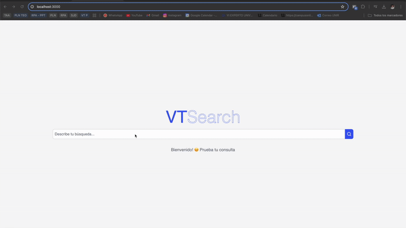

# Query Translator - Backend in Python 🐍

This is the backend for the **Query Translator** project, developed in **Python** using `pydantic` for data validation and other utilities. This backend processes queries and transforms data efficiently.

## 🎥 Test Video
Here is a sample test video demonstrating the backend with a simple Next.js frontend. In this example, a query was passed in Spanish with intentional spelling mistakes to test the system’s ability to handle and process imperfect input:




## 🚀 Setting Up the Environment

To run this backend on your local machine, follow these steps:

### 1️⃣ Clone the Repository
```bash
git clone https://github.com/arturoaguileraa/vtsearch.git
cd vtsearch
```

### 2️⃣ Create and Activate a Virtual Environment
On **Linux/macOS**:
```bash
python3 -m venv venv
source venv/bin/activate
```

On **Windows**:
```powershell
python -m venv venv
venv\Scripts\activate
```

### 3️⃣ Install Dependencies
With the virtual environment activated, install the required packages:
```bash
pip install -r requirements.txt
```

### 4️⃣ Set Up Environment Variables and Decide AI model
Create a `.env` file in the project's root directory and add the necessary variables.

Example `.env` file:
```
API_KEY=your_gemini_api_key
```

Now in core/ai_client.py you can choose the AI model you want to use. Set isOllama to True if you want to use Ollama, or False if you want to use Gemini.

### 5️⃣ Run the Backend
```bash
uvicorn main:app --reload
```

---

## 📂 Project Structure
```
query_translator/
│── config/            # Project configuration
│── core/              # Main logic (query processing, validation)
│── handlers/          # Event and route handlers
│── utils/             # Additional utilities
│── venv/              # Virtual environment (ignored by Git)
│── .gitignore         # Files ignored by Git
│── main.py            # Backend entry point
│── requirements.txt   # List of dependencies
│── test_gemini.py     # Tests for Gemini AI
│── test_pipeline.py   # Integration tests
```

## 📌 Additional Notes
- Make sure you are using **Python 3.8 or later**.
- Remember to activate the virtual environment **before running the project**.
- To deactivate the virtual environment, use:
  ```bash
  deactivate
  ```

You're all set! Now your backend is ready to run.

---
✉️ **Contact:** If you have any questions or suggestions, open an issue in the repository.